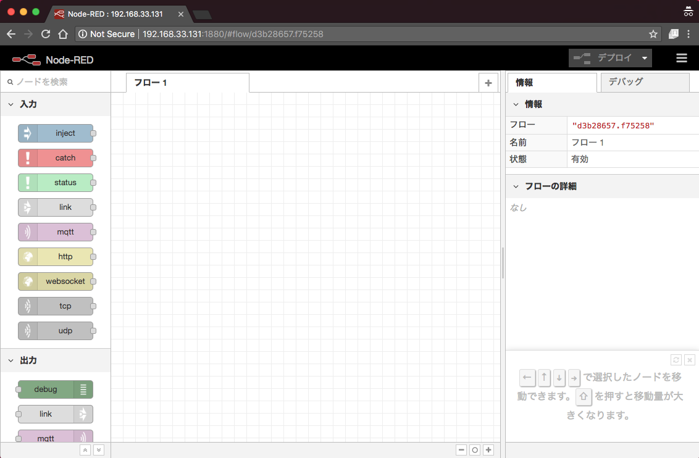

# Node-RED Vagrant

## 用途

+ Vagrantを用いて、Node-REDの環境構築をします
+ systemdを使って永続化します

## 構築方法

### 1. 環境構築

+ Vagrantの起動

```
cd opsfiles/vagrant
vagrant up nodered-vagrant
```

+ Vagrantにログイン

```
vagrant ssh nodered-vagrant
```

---> Vagrantにて作業を進める :package:


### 2. Node-REDのインストール

+ :package: 一般ユーザに変更
    + `node-red` を使用する

```
sudo su - node-red
```

+ :package: アプリのPATHに移動　

```
cd /usr/local/node-red
```

+ :package: 一般ユーザにてNode-REDをnpmインストールする

```
sh init-node-red.sh
```

+ :package: Node-REDをsystemdを使ってデーモン化(+ 起動)する

```
sudo systemctl start node-red
```

### 3. アクセス

+ ブラウザからアクセス

http://192.168.33.131:1880/




### 99. 停止・削除

+ :package: Node-REDの停止

```
sudo systemctl stop node-red
exit
```

+ Vagrantの停止

```
cd opsfiles/vagrant
vagrant halt nodered-vagrant
```

+ Vagrantの削除

```
cd opsfiles/vagrant
vagrant destroy -f nodered-vagrant
```
